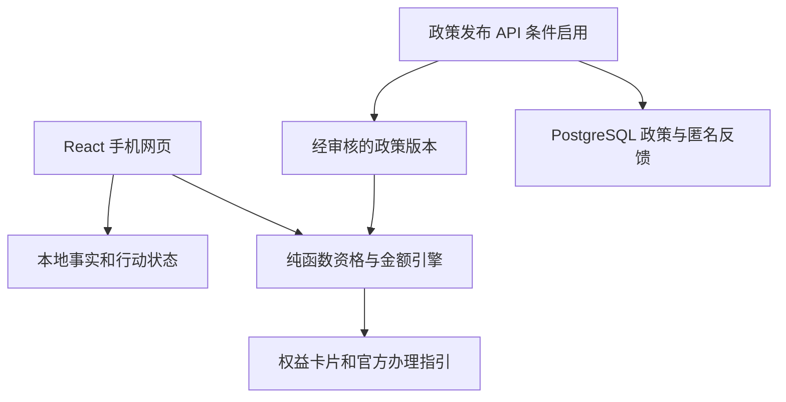

# 个人权益发现 Phase 1 验证与 Phase 2 架构规划

版本：2026-09-30。基线提交：`64fb9a3`。范围以本仓库现有的上海租房原型为准。

## 决策摘要

保留现有 Vite 8、React 19、TypeScript 前端，不重写为 Next.js，也不在当前两项权益原型中引入服务端资格判断。首轮试点继续让用户事实和评估留在浏览器，政策使用经人工审核的版本化数据；现有 `localStorage` 仅适用于演示和受控试点，不应被描述为已具备跨设备、永久保存或真实系统提醒。若试点需要远程政策更新和接收反馈，再增加 TypeScript Fastify API 与 PostgreSQL；API 只保存公开政策版本、审核记录和经脱敏的反馈，不接收工资、住房和公积金余额。传输采用 HTTPS 上的 JSON REST，静态资源由 Vite 构建后发布。这个架构把服务器变成政策发布与运维层，资格计算继续在本地按同一份规则执行。

**发布门槛：当前原型不能直接作为对外权益建议产品。** 独立探针 8 项中 4 项未通过，尤其是“需核实却显示可提取金额”和“少缴区间倒置”。此外，政策元数据的日期、缴存城市与工作城市混用、页面“真实评价”标题等需要修正。2026-09-30 的代码已处理这些探针和页面问题，复跑结果写在文末「进度」；对外仍要等政策研究按官方页面确认施行截止日和资格分支。

## Phase 1 需求深度调研

### 3 技术选型确认

| 层 | 当前仓库 | 确认方案及理由 | 引入时机 |
| --- | --- | --- | --- |
| 前端 | Vite 8 + React 19 + TypeScript；自写 hash 路由和 `useSyncExternalStore` store | 保留。手机端原型、两项权益和静态部署已经可运行；当前不迁移路由或状态库。`react-router-dom`、`zustand` 尚未使用，后续清理依赖。 | 现在 |
| 资格判断 | `src/lib/evaluate.ts`，规则和金额写死在代码 | 抽出纯函数的领域模块；输入包含显式 `asOf`、纳税年度、政策版本与用户事实；输出分开表示资格、办理状态、金额类型、证据缺口。模型只辅助提取或解释，不直接裁决。 | Sprint 0–1 |
| 政策知识 | `policies.ts` 元数据 + `guides.ts` 文字；三个位置重复写金额 | 单一版本化政策清单，以官方来源、适用区间、人工复核状态和参数为中心生成展示文案；发布前人工审批。原文快照保存哈希与来源，不把社区讨论当正式依据。 | Sprint 1 |
| 用户数据 | 浏览器 `localStorage` | 受控试点维持本地存储；只记录用户主动提供的最少字段、事实确认时间、独立的资格和行动状态，提供一键清除。普通 Web 存储不等于加密保险箱，禁止保存证件号码、账户凭证和工资单原件。 | Sprint 0–2 |
| 后端 | 无 | 需要远程政策发布或真实反馈收集时增加 Fastify + TypeScript 的单体 API；不设用户资料与远程评估接口。Fastify 可用 JSON Schema 验证请求和响应。 | Sprint 3 的条件项 |
| 数据库 | 无 | 首轮不需要服务端数据库；后端上线时用 PostgreSQL 保存政策来源、版本、发布审核和匿名反馈。规则参数可放小型 `jsonb`，版本及关联仍使用关系字段。 | 随后端启用 |
| 协议 | 静态 HTML/CSS/JS；官方链接跳转 | 前端和 API 同源 HTTPS；`GET` 公开政策清单与版本，`POST` 脱敏反馈；JSON Schema 校验；不请求税务或公积金登录信息，也不代办。 | 静态现在；API 随需求启用 |

**未选方案。** 直接上 Next.js 会重写现有已完成的前端，当前没有服务端渲染需求。Python 后端会使资格规则在 TypeScript 前端和 Python 服务端重复实现。把所有个人资料上传服务器会增加隐私和安全范围，而现阶段的发现任务可以在本地完成。仅以大模型检索政策生成资格结论缺少确定性和可复现的版本记录。

**依赖与部署。** 当前 `npm ci`、`npm run build`、`npm run lint` 在 Node 24.19.0 上成功；仓库 README 要求 Node 20+，最低 Node 版本和 Vite 8 实际要求仍需在 CI 中对 Node 20 与 22 复测后确定。静态发布需 HTTPS 和明确的缓存策略。引入 API 时锁定一套 Fastify 主版本与 PostgreSQL 主版本，先在独立环境验证迁移和备份，再投入真实反馈收集。

### 4 关键组件独立验证

运行方法：`npm ci && npm run build && npm run lint && node scripts/validate-components.mjs`。探针独立打包并直接调用现有 `evaluate()`，不靠页面点击样本。加 `--strict` 会在失败时返回非零退出码，适合修复后的 CI 门禁。

| 组件及场景 | 结果 | 观察与处理 |
| --- | --- | --- |
| 构建、类型与 lint | 通过 | Vite 输出 `dist/`；这只能证明工程可构建，不证明政策判断正确。 |
| 完整样本，两项金额分开 | 通过 | 两项都是 `possible`，返回不同金额类型。 |
| 住房未知不被视为符合 | 通过 | 两项状态均为 `need_verify`。 |
| 已填报租金扣除不再估算新增退税 | 通过 | 税额上界为空，但当前代码把“已填报”当资格不符合，状态语义需拆分。 |
| 未连续缴存三个月 | 通过 | 公积金不输出可提取额。 |
| **资格需核实但仍输出金额** | **失败** | 用户住房未知时，公积金仍给出 `fundUpper=40000`，个税仍给出 `taxHigh=3000`；发现页标题会写“可提取”“少缴”。修复前不能对外展示该金额。 |
| **税额区间有序** | **失败** | 月预缴税输入 1 元时得到 `450–12` 元，违反下界不高于上界。不能只做格式排序，应重新审视年化预缴税与“少缴”估算假设。 |
| **非法租约月份** | **失败** | `2026-13` 至 `2026-14` 仍产生 `fundUpper=4000`；必须严格校验年月、起止先后和当前周期。 |
| **运行日期** | **失败** | `TODAY=2026-09-27`，运行日为 2026-09-30；规则有效性和年度提示会随时间失真。演示固定日期必须是显式测试参数，正式运行取可注入的当前日期。 |

**政策来源核对。** 仓库将公积金政策生效日写成 `2024-10-01`、失效日写成 `2027-12-31`。上海官方通知写明自 **2024-11-01** 施行、有效期五年；目前两个字段均不应原样进入正式规则。更重要的是“政策有效期”“2026 年纳税年度”“用户租期”属于三条时间轴，不应共用一个 `effectiveTo`。税务来源描述月额与计算月份；详细资格判断须与其原文分支对照。[政策来源 A、B]

**尚未验证的部分。** 自动化探针未覆盖真实浏览器的 `localStorage` 清除/隔离、hash 路由跳转、移动端布局、官方外链可达性、性能和可访问性；尚无后端与 PostgreSQL，因此不能宣称这些组件已验证。页面的系统 `Notification` 目前是在设置时发送确认通知，不是到期时由服务端唤醒的提醒；反馈仅保存在本机，团队收不到。政策页“真实评价”内容是概括要点及无 URL 的社区话题，并没有可核实的真实用户评价，须改名或提供真实来源。

## Phase 2 架构设计与规划

### 1 与 PRD 对齐的整体 Plan

用户任务继续限定为“上海租房时是否遗漏住房租金个税扣除及市场租赁住房公积金提取”。一次输入共享租约事实，两项结果分别展示税前扣除与本人账户资金；用户在官方渠道完成最终填报或提取。前端原型已经有首页、问答、发现、详情、政策和进度页，本阶段是在其上建立可靠规则与反馈，而不是重做页面。首轮指标为“经人工核实的新增且合格机会”和“从发现到用户确实办理”，不能以卡片点击量或月限额之和代替收益。

#### PRD：问题、用户与范围

**目标用户。** 首轮是上海工作、租住市场住房，愿意自己核对并办理权益的个人，尤其是不清楚租金专项附加扣除或公积金租房提取规则者。用户目标是在几分钟内知道自己还缺什么事实、可能遗漏哪项、该去哪个官方渠道办理。政策审核者需要能追溯每个结论依据的原文、版本与适用日期。产品不替官方机构判定资格，不代办、不索取账号密码或证件原件。

**核心问题。** 同一个租房事实可能关联税前扣除和本人公积金账户提取，但两项适用条件、金额意义和办理机关不同；现有页面把不确定情况与可领取金额并列，容易造成误解。成功体验是让用户能分清“确定符合的必要条件”“尚待确认的条件”“已经办理的事项”，并能从卡片直达相应官方指引。

| 优先级 | 需求与用户故事 | 产品验收条件 |
| --- | --- | --- |
| P0 | 作为租房者，我只回答与两项权益相关的事实，并能选“不清楚”。 | 共享租期和租金，分别问纳税申报、缴存城市、连续缴存、配偶住房和冲突业务；每个关键事实可更正、显示确认时间；未答不能被推定为符合。 |
| P0 | 作为租房者，我要看懂每项机会为何出现。 | 每项独立给出资格状态、是否已办理、命中和缺失条件、政策版本与来源；已办理不能提示“新增收益”。 |
| P0 | 作为租房者，我需要可信的金额解释。 | 区分扣除基数、估计少缴税额与本人账户可提取额；只有前提确认且规则有效时才展示估算；区间有序、金额非负，不能把两项金额相加成“补贴”。 |
| P0 | 作为租房者，我希望知道下一步。 | 需核实时给一条具体追问；可能符合时给官方渠道、材料准备和办理步骤；不符合时解释明确的阻断条件；所有外链标示官方主体。 |
| P0 | 作为政策审核者，我要纠错并回溯。 | 规则来源、发布时间、适用区间、复核人和 release ID 可查；被撤回或过期的规则不继续输出金额；每个展示条件可追到来源。 |
| P1 | 作为租房者，我要管理本机输入和办理进度。 | 能更正、清除本地事实，行动进度单独保存；明确说明浏览器数据可能因清理或换设备丢失。 |
| P2 | 作为试点团队，我想收集问题并更新政策。 | 仅在远程发布和反馈需求成立时启用 API；反馈自愿且先脱敏，不能把个人画像随请求上传。 |

**信息架构与关键路径。** 首页说明两项权益及金额区别 → 问答收集事实 → 发现页按“待确认 / 可能符合 / 已办理 / 明确不符”呈现两张独立卡片 → 详情解释条件与依据 → 官方办理指引 → 用户自行更新行动状态。用户从任何详情页返回问答时，修改事实必须让旧结论重新计算。

| 卡片状态 | 高亮与指引块 | 金额区域 | 主动作 |
| --- | --- | --- | --- |
| 需核实 | 中性醒目标签写“还需确认”，先列一项最有判别力的缺失条件和原因；其他缺失项可展开。 | 不出现“可领”“少缴”的数字标题；可显示政策一般限额，但必须明确它不是个人估算。 | “确认住房情况”等针对性追问。 |
| 可能符合且未办理 | 标签写“可能符合”，列已满足条件、估算假设、政策版本；办理块列官方入口与准备事项。 | 显示带单位和类型的区间或上限，不把账户提取写成新增收入。 | “查看官方办理步骤”。 |
| 已办理或已填报 | 标签写“已处理”，保留条件核对和用户自行记录的时间，不重复承诺收益。 | 隐藏新增收益，历史金额若保留须标注旧版本与估算性质。 | “查看记录 / 更正状态”。 |
| 明确不符或政策待复核 | 指出具体阻断条件，或写明“政策需复核”；颜色须配文字和图标，不能只靠红绿。 | 不展示个人可得金额。 | “查看依据 / 更正事实”。 |

**非功能验收。** 手机窄屏能完成核心路径；输入、状态与金额对屏幕阅读器有文字标签；静态资源走 HTTPS；无个人资料分析埋点；异常数据和政策版本校验失败时降级为需核实；官方链接打开前能识别目标机关。试点由政策审核者抽样核对结论和文案，严重误报为零是上线门槛而不是对未来准确率的保证。

**衡量方式。** 记录受控试点中经人工核实的新机会人数、未知条件被补全比例、用户报告的实际办理比例、误报/漏报原因及政策版本；只汇总经用户同意的匿名反馈。不把页面停留、点击或宣称的月度限额当作真实收益。基线由 Sprint 3 访谈建立，样本数小不用于推断全体上海租房者。

**范围外。** 自动提交税务或公积金申请、跨省规则、社保医保等其他权益、全自动政策抓取发布、跨设备个人账户与真正的定时提醒；后续若加入这些能力另行定义需求与风险。

现有 PRD 的三态只描述**资格**。下一版需将其与**机会是否尚未办理**分开：资格 `possible / need_verify / ineligible`，行动 `not_started / already_claimed / applied / completed / rejected`。规则过期另设 `policy_unverified`，不得伪装成用户不符合。金额字段也要标明 `deduction_base / estimated_tax_saving / owned_fund_access`，并带估算时间、假设和政策版本。

### 2 系统架构

**规则输入与输出契约。** `evaluate({ profile, policyRelease, asOf, taxYear })` 返回每项的 `eligibilityStatus`、`actionStatus`、`conditionTrace`、`amountView`、`missingFacts`、`ruleVersionId`。`conditionTrace` 的每一项至少包含字段、用户答案来源、规则依据和结论。只有必要条件全部确认、规则经人工复核且该用户尚未办理时，发现卡片才可以使用“可能符合”并展示有明确前提的金额。未知、冲突、年份跨越或来源失效时返回“需核实”且不展示“现在可提取/少缴”的数值标题。租期和金额的解析必须拒绝非法输入，绝不偷偷用 12 个月或 4000 元兜底。

**规则知识结构。** `PolicySource` 保存官方 URL、发文机关、发布日期、页面/文件摘要哈希、抓取与复核时间；`PolicyVersion` 保存所属权益、地区、适用期间、规则状态、参数和关联来源；`PolicyRelease` 是一批经过双人复核后发布的版本。政策研究可用 AI 提取候选条件，但只有人工校对原文及反例后才能发布。前端对当前 release 缓存并显示版本；过期或校验失败就停止金额建议。上海市场租赁的一般月限额是 4000 元，但对新市民、青年人等有不同分支，单个通用上限不能代表所有用户。[政策来源 B]

**用户事实。** 现有 `workCity` 不等于公积金缴存城市，需增加 `pfContributionCity`；现有 `alreadyExtracted` 不等于是否存在冲突的其他生效提取业务，需分开提问。租期、住房、婚姻、缴存和申报状态均保存确认时间；用户修改事实时重新评估并让旧结论失效。演示样本不应覆盖真实用户资料，除非先明确提示并确认。工资单目前只存文件名，界面应称“选择文件名演示”，或删除伪上传入口，不能让用户以为文件已经解析。

**展示与动作。** 卡片先突出缺失条件和下一步动作，再展示金额。若 `need_verify`，主按钮是“确认本人或配偶在沪住房情况”；若已填报，转为“已处理，查看记录”；若资格不符，解释哪一项明确阻断。高亮颜色不能代替文字状态。行动进度与政策闹钟独立，确认型浏览器通知不等于届时通知。对外上线前“真实评价”必须有可核实的来源和展示授权，否则改成“适用要点与常见误解”。

**后端及协议边界。** 当前静态版无业务 API。达到远程政策更新门槛后，同源 HTTPS 接口可从最小集合起步：`GET /v1/policy-releases/current`（ETag、`releaseId`、`reviewedAt`、`rules`）、`GET /v1/policy-sources/:id`、`POST /v1/feedback`（仅政策版本、问题类型和用户自愿填入的脱敏描述）。以 JSON Schema 校验请求/响应，保持 `v1` 兼容，不提供上传个人画像的 `/evaluate`。浏览器仍在本地计算。后端日志不得记录敏感字段和完整自由文本；反馈上线前需要单独的告知、删除及审核方案。[个人信息来源 C]

**数据库最小表。** `policy_source`、`policy_version`、`policy_release`、`release_version`、`review_event`、`feedback`。版本发布采用事务，旧 release 保留可回滚；反馈与政策版本关联，避免投诉指向已经变化的规则。正式数据库不建用户工资、税额、公积金余额表。政策量很小时可以先用仓库中的版本化 JSON 替代数据库，但必须维持同一数据契约；只有远程发布、多人审核或反馈确有需求时才迁移 PostgreSQL。

### 3 Sprint 排期与验收门槛

以下以每个 Sprint 一周估算，先保证规则安全，再考虑运维后端。人员假设为一名前端/全栈开发、一名产品/政策核对者；若实际人力不同，日期按交付门槛调整。

| Sprint | 交付范围 | 完成标准 |
| --- | --- | --- |
| 0：规则安全（第 1 周） | 修复探针 4 个失败项；增加缴存城市与冲突业务字段；把资格和行动拆开；去掉无依据“真实评价”；修正政策时间元数据。 | `validate-components --strict` 全通过；新增金额边界、日期、已领取、未知与互斥测试；`npm run build`、`npm run lint` 通过；政策研究者逐项签字。 |
| 1：政策版本（第 2 周） | 官方来源和参数合并为单一政策 manifest；规则 evaluator 以 `asOf` 和税年运行；来源与规则版本可追溯。 | 修改月限额时只改一处；模拟政策失效后所有金额提示关闭；历史结果保留 release ID；至少 20 个反例经人工核对。 |
| 2：用户闭环（第 3 周） | 精简追问与卡片；已办理与资格状态分别展示；问答更正和删除；移动端及无障碍检查。 | 核心任务在手机端完成；任何未知项不能显示即时可领金额；用户能更正事实、清空资料、分清两个权益的金额含义。 |
| 3：受控试点（第 4–5 周） | 访谈 20 人、受控测试最多 100 人、人工核对机会与实际办理反馈。若需要远程发布或团队接收反馈，再做 Fastify/PostgreSQL 技术验证。 | 记录误报、已知但未办理原因及实际办结；达到 PRD 的合格机会目标，严重误报为 0；才决定是否接入 API。 |

**进入后端实施的决策点。** 先确认至少一种实际需求：政策更新频率使静态发布不可接受，或匿名反馈有足够数量需要团队处理。若都没有，保持静态架构即可。下一阶段若要跨设备账户、自动提醒或处理上传文件，需另起 PRD，先评估身份、数据留存、敏感信息授权与运行成本，不能把它们当成本计划的自然延伸。

## 进度

上文「关键组件独立验证」是施工前的审计快照，四项失败按当时结果保留。下面记录随后落地的修改。规划文首的基线 `64fb9a3` 不是本仓库提交；本仓库首个可运行版本是 `84f9eb5`，本次改动从那里接着做。

### 2026-09-30 · 规则安全与不依赖新接口的 Phase 2

**探针。** 原先失败的四项已写入 `scripts/validate-components.ts`，用 `npm run validate -- --strict` 复跑并通过：

- 住房未知时，两项资格都是 `need_verify`，不再输出 `fundUpper` 或个税上界，发现页标题也不再写个人「可提取」「少缴」。
- 月预缴税 1 元时，少缴上界会低于 3% 下界。区间撤回，不再展示 `450–12`，也不把两个数字对调后当成有效估算。
- 租期 `2026-13` 至 `2026-14` 不产出金额，也不回落到 12 个月或 4000 元。
- 不传日期时，`evaluatedAt` 取运行当天；测试可注入 `asOf`。`asOf` 为 `2024-10-15` 时，公积金是 `policy_unverified`，且没有个人可提取额。

另外两条也已通过：政策版本被标成撤回后，两项都停止个人金额；月限额和介绍文案都读 `src/lib/policyRelease.ts`，不再在计算、政策和指南里各写一遍。

**资格与办理分开。** 资格是 `possible / need_verify / ineligible / policy_unverified`。办理是 `not_started / already_claimed / applied / completed / rejected`。已经填报租金扣除或已经提取，只记成已办理，资格不再被判成「用户不符合」，卡片显示「已处理」且不再估算新增金额。旧的本地行动状态在读取时迁移。

**政策时间轴。** 参数、施行区间和复核状态只写在 `src/lib/policyRelease.ts`，版本号 `sh-rent-2026-09-27`。个税按 2026 纳税年度；公积金按通知自 2024-11-01 施行、暂记至 2029-10-31；用户租期单独计算。这三条不再共用一个失效日。运行日不再写死成 2026-09-27。

**事实字段。** 新增 `pfContributionCity`，工作城市不能代替缴存城市。新增 `otherActiveExtraction`，和「是否已经提取」分开。事实修改会记下 `confirmedAt`。工资单入口只保留文件名，文案是「选择文件名演示」。演示样本在套用前先确认，并带上缴存城市和其他生效提取的答案。

**页面。** 政策介绍里的「真实评价」改为「适用要点与常见误解」。发现卡片在没有个人估算时使用不含数字的标题；条件已确认但这次不展示金额时，标题是「条件已确认，这次不展示个人金额」。需确认时，主按钮指向下一项缺失事实，例如「确认公积金缴存城市」。资料页说明数据只在本机。提醒仍然只是设置时的确认，不会到点唤醒。

**依赖。** 去掉未使用的 `react-router-dom` 和 `zustand`。校验脚本用 Node 的类型剥离加载 TypeScript，不额外打包。

**这次没有做。** 没有 Fastify、PostgreSQL，也没有 `GET /v1/policy-releases/current`、`GET /v1/policy-sources/:id`、`POST /v1/feedback`。浏览器仍然本地计算，不上传个人画像。规划里的独立 `conditionTrace` 还没有单独成字段，条件留在每条机会上。新市民、青年人只在分支说明里提示，没有单独一问。Sprint 3 的访谈和受控试点不在这次代码里。

**仍要人工确认后才能对外。** 公积金五年届满是否就是 2029-10-31，以及新市民、青年人要不要单独提问，都还没有政策研究签字。远程政策发布或团队接收脱敏反馈如果确实需要，再按规划增加上述三个接口；在此之前不改接口。

## 交付与复现

本文件是 Phase 2 规划的工作区版本；原始 PRD 保留在先前文档中。独立探针位于 `scripts/validate-components.mjs`，可重复运行。施工前的四项失败已按上一节修复；政策研究负责人仍应根据官方最新页面重新确认时点及资格分支，之后才能把结论当作对外签字。

## 依据

- 仓库基线：`README.md`、`docs/开发文档.md`、`src/lib/{types,policies,evaluate,store,guides}.ts`，提交 `64fb9a3`。
- 政策来源 A：上海税务局《住房租金专项附加扣除热点问答》，https://shanghai.chinatax.gov.cn/zcfw/rdwd/202603/t479656.html 。
- 政策来源 B：上海市公积金管理委员会《关于优化本市住房公积金租赁提取业务相关事项的通知》，https://service.shanghai.gov.cn/XingZhengWenDangKuJyhTest/XZGFDetails.aspx?docid=241015151102JbADRZpu6KkOIFz6TBv 。
- 个人信息来源 C：《中华人民共和国个人信息保护法》，https://www.cac.gov.cn/2021-08/20/c_1631050028355286.htm 。
- 技术文档：Vite 8 构建 https://v8.vite.dev/guide/build ；Fastify 请求与响应校验 https://fastify.dev/docs/latest/Reference/Validation-and-Serialization/ ；PostgreSQL JSON 类型 https://www.postgresql.org/docs/current/datatype-json.html 。
